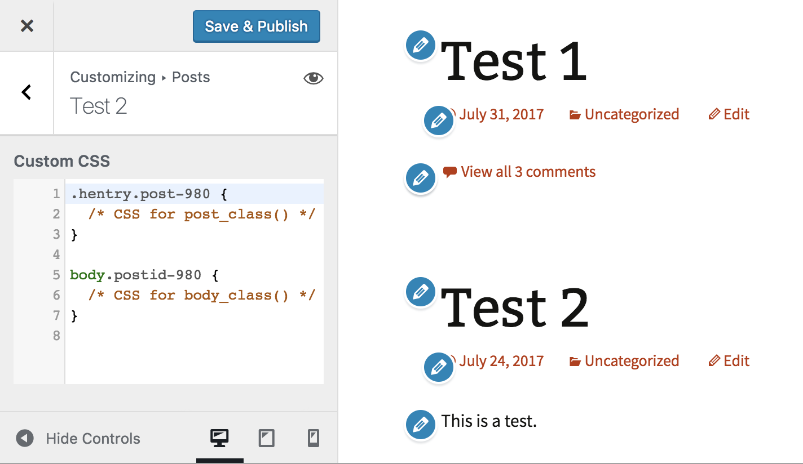

<!-- DO NOT EDIT THIS FILE; it is auto-generated from readme.txt -->
# Customize Posts CSS

Add custom CSS for any post or page on any archive or singular template with editing and previewing in the Customizer.

**Contributors:** [xwp](https://profiles.wordpress.org/xwp), [westonruter](https://profiles.wordpress.org/westonruter)  
**Tags:** [customizer](https://wordpress.org/plugins/tags/customizer), [customize](https://wordpress.org/plugins/tags/customize)  
**Requires at least:** 4.9  
**Tested up to:** 4.9  
**Stable tag:** 0.1.0  
**License:** [GPLv2 or later](http://www.gnu.org/licenses/gpl-2.0.html)  
**Requires PHP:** 5.4  
**Depends:** Customize Posts  

  

## Description ##

Since WordPress 4.7 core has provided an Additional CSS section in the Customizer for users to add and preview custom CSS for their site (see [#35395](https://core.trac.wordpress.org/ticket/35395)).

This plugin brings the same functionality to be able to provide custom CSS for individual posts and pages on your site. The custom CSS will be output in `style` elements whenever `the_post` is done. The CSS is stored in a `custom_css` postmeta and Custom CSS is presented for every post that has the `custom_css` post type support, which is given to all public posts by default.

This plugin has a few dependencies:

* It requires the [Customize Posts](https://wordpress.org/plugins/customize-posts/) plugin for adding the ability to manage and preview postmeta in the Customizer. The Custom CSS control is added to the post/page Customizer sections which this plugin adds.
* It relies on CodeMirror being in core as of 4.9-alpha. See [#12423](https://core.trac.wordpress.org/ticket/12423).
* It uses the `WP_Customize_Code_Editor_Control` proposed for WordPress 4.9. See [#41897](https://core.trac.wordpress.org/ticket/41897).

See also [#38707](https://core.trac.wordpress.org/ticket/38707) which proposes extending the Custom CSS editor in core with being able to edit per page CSS.

## Screenshots ##

### Custom CSS control appears in each post section with initial selectors for targeting post/page in post container and body container.

### The custom CSS appears with the post on an index page, and here the `.hentry` selector is key.

### The custom CSS also appears with the post on its singular template, and here a `body` selector with an appropriate post-specific class name is useful for changing the look of the entire page.

## Changelog ##

### 0.1.0 ###
Initial release.

